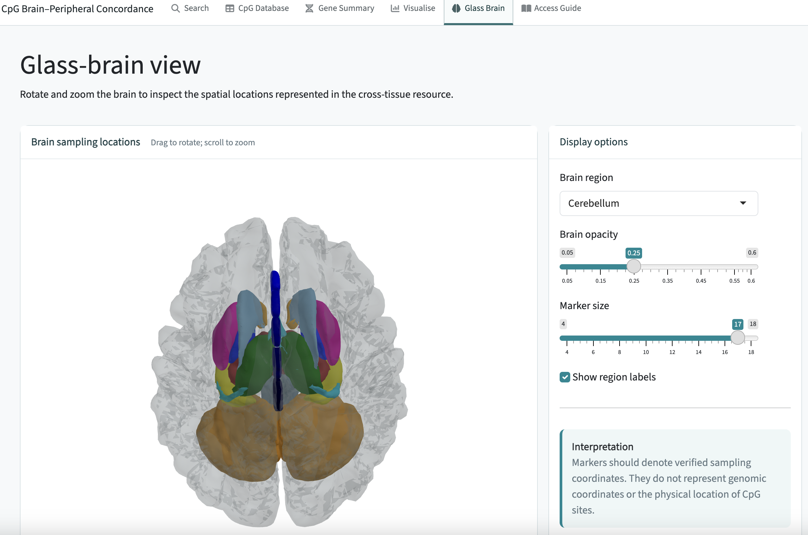
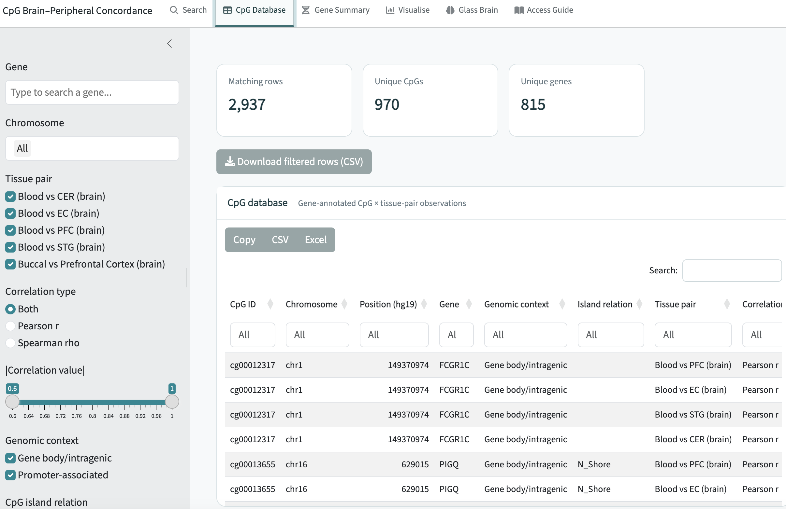

# TRACE CpG: cross-tissue DNA methylation concordance in human brain and peripheral tissue samples

## Licensing

The source code in this repository is released under the MIT License.

Published supplementary datasets included in `data/raw/` remain the copyright of
their original authors and publishers and are distributed only for the purpose of
reproducing the published pipeline. Users should consult the original publications
for the applicable terms of use.

Any downloaded GEO datasets are not redistributed with this repository and must
be obtained from NCBI GEO.

___

# TRACE-CpG:
**TRACE-CpG**: **T**issue **R**eference-database for **A**nalysing **C**oncordant-**T**issue **E**pigenetics

There is currently no unified, curated resource that systematically collates published evidence on cross-tissue DNA methylation concordance at individual CpG sites. This project seeks to systemically review this research landscape and develop a harmonised and versioned database of published brain-peripheral DNA methylation measured from matched individuals, designed to be reproducibly updated as new studies become available.

The project brings together currently fragmented cross-tissue DNAm resources into a
common database, enabling comparison of concordance estimates across studies,
peripheral tissues, brain regions and DNAm platforms.

The TRACE-CpG project will involve:

1. a systematic identification and screening workflow for eligible studies and datasets;
2. a harmonised CpG-level database of brain–peripheral DNAm concordance estimates;
3. reproducible pipelines for data acquisition, processing, annotation and analysis;
4. analyses of the magnitude, tissue specificity and reproducibility of cross-tissue
   DNAm concordance; and
5. an interactive web application for querying and visualising the resulting resource.

## Repositry

This repository aims to curate a database of all published CpG-site correlations between peripheral tissues (blood, buccal) and brain regions (prefrontal cortex, superior temporal gyrus, entorhinal cortex, cerebellum), compiled from published cross-tissue methylation studies to date. At present the prototype database is built from published correlations from the following studies:

- Hannon E, et al. (2015). *Epigenetics*, **10**(11), 1024–1032. DOI: [10.1080/15592294.2015.1100786](https://doi.org/10.1080/15592294.2015.1100786)

- Edgar RD, et al. (2017). *Translational Psychiatry*, **7**, e1187. DOI: [10.1038/tp.2017.171](https://doi.org/10.1038/tp.2017.171)

- Braun PR, et al. (2019). *Translational Psychiatry*, **9**, 47. DOI: [10.1038/s41398-019-0376-y](https://doi.org/10.1038/s41398-019-0376-y)

- Sommerer Y, et al. (2022). *Clinical Epigenetics*, **14**, 118. DOI: [10.1186/s13148-022-01357-w](https://doi.org/10.1186/s13148-022-01357-w)

- Nishitani S, et al. (2023). *Translational Psychiatry*, **13**, 72. DOI: [10.1038/s41398-023-02370-0](https://doi.org/10.1038/s41398-023-02370-0)

  

<b>Figure 1.</b> Overview of the CpG Concordance Database. Published brain–peripheral DNA methylation concordance resources were harmonised into a unified searchable database and interactive web application.

## Scientific rationale

DNA methylation is strongly tissue- and cell-type-dependent, yet peripheral tissues
such as blood, saliva and buccal samples are frequently used in human studies of
brain-related phenotypes because brain tissue is generally inaccessible in living
individuals.

Several studies have therefore measured DNAm in matched brain and peripheral tissues
and estimated CpG-level cross-tissue correlations. Existing resources differ in their
sample populations, peripheral tissues, brain regions, methylation platforms,
pre-processing pipelines, correlation metrics, adjustment procedures and criteria for
reporting CpGs.

TRACE-CpG aims to systematically identify these studies and harmonise their CpG-level
results into a common database from which secondary analyses can be performed. 
This enables the published evidence base to be comprehensively characterised, 
including the extent to which apparent cross-tissue concordance
is reproducible across independent datasets and tissue comparisons.

## Scope

Studies are considered for TRACE-CpG where they provide DNAm data from
matched human brain and peripheral tissue samples and either:

- report CpG-level cross-tissue concordance statistics; or
- provide sufficiently complete CpG-by-sample methylation data and sample metadata
  for CpG-level concordance to be derived.

Peripheral tissues may include blood, saliva, buccal tissue and other accessible
non-brain tissues where eligible data are identified. Brain samples may include postmortem or surgically resected tissue and may represent
different anatomical regions. Both array-based and sequencing-based methylation studies are eligible where the
required CpG-level information can be obtained.

## TRACE-CpG database

### Unit of observation

The fundamental observation in TRACE-CpG is a **CpG × tissue-comparison estimate**.

A CpG may therefore occur multiple times where concordance has been estimated between
the same peripheral tissue and multiple brain regions, or under different analytical
conditions.

For example, a study may report separate correlations between blood DNAm and DNAm in:

- prefrontal cortex;
- entorhinal cortex;
- superior temporal gyrus; and
- cerebellum.

These represent distinct cross-tissue estimates and are retained separately.

Accordingly, a CpG identifier alone does not uniquely identify a database observation.
The identifying fields additionally include the contributing dataset, tissue comparison
and, where relevant, analytical specification.

### Data retained

For each CpG-level observation, TRACE-CpG will retain, where available:

- CpG identifier;
- gene annotation;
- chromosome and genomic position;
- genic annotation;
- CpG-island context;
- source study;
- dataset or resource name;
- DOI and/or PMID;
- sample size;
- brain region;
- harmonised brain-region category;
- peripheral tissue;
- harmonised peripheral-tissue category;
- tissue pair;
- correlation coefficient;
- correlation metric;
- P-value and/or adjusted P-value;
- source-data scope (e.g. genome-wide, filtered or statistically selected);
- original CpG-selection or concordance definition;
- methylation platform;
- live versus postmortem brain tissue;
- population characteristics, where available;
- analytical adjustment information, where available; and
- transformations or harmonisation applied within TRACE-CpG.

Additional study-, sample-, CpG- or analysis-level variables may be incorporated where
available and relevant to the interpretation, harmonisation or subsequent analysis of
cross-tissue DNAm concordance.

Original source information is retained to allow individual observations to be traced
to the contributing study or dataset.

### Complete and filtered datasets

Where complete or substantially complete CpG-level correlation matrices are available,
all eligible correlation estimates are retained irrespective of correlation magnitude
or statistical significance.

Some published resources provide only subsets of CpGs selected according to statistical,
variability or other criteria. These datasets remain eligible, but their selection status
is explicitly recorded.

Prespecified correlation thresholds are therefore used for derived classifications and
analyses rather than as general inclusion criteria for the master database.

---

## Currently identified cross-tissue resources

The initial development of TRACE-CpG has been informed by published matched-tissue
resources including:

- **Hannon E, et al. (2015).** *Epigenetics*, 10(11), 1024–1032.
  DOI: 10.1080/15592294.2015.1100786

- **Edgar RD, et al. (2017).** *Translational Psychiatry*, 7, e1187.
  DOI: 10.1038/tp.2017.171

- **Braun PR, et al. (2019).** *Translational Psychiatry*, 9, 47.
  DOI: 10.1038/s41398-019-0376-y

- **Sommerer Y, et al. (2022).** *Clinical Epigenetics*, 14, 139.
  DOI: 10.1186/s13148-022-01357-w

- **Nishitani S, et al. (2023).** *Translational Psychiatry*, 13, 72.
  DOI: 10.1038/s41398-023-02370-0

This list describes resources identified during initial development and should not be
interpreted as the final set of studies eligible for TRACE-CpG. Final inclusion is
determined through the systematic screening workflow.

---

## Prototype resource

The current repository contains a **developmental prototype** of the TRACE-CpG database
and web application.

The prototype was assembled from a subset of published resources to establish and test:

- data structures;
- tissue and brain-region harmonisation;
- CpG annotation;
- visualisation approaches;
- database querying;
- data extraction procedures; and
- the interactive application architecture.

The prototype should therefore not be interpreted as the final systematically identified
TRACE-CpG evidence base.

## Data Acquisition Scripts 
### Automated literature identification and screening

### `Extract_pubmed_screening.R`

Runs the preregistered PubMed search, retrieves citation metadata
and abstracts using the Entrez API, automatically prioritises
potentially eligible studies, and generates the screening CSV and
Excel workbooks used during study selection.

### `Extract_scopus_screening.R`

Runs the corresponding Scopus search using the Elsevier Scopus API and retrieves available citation metadata and abstracts. The script applies the same gate-based automated screening and prioritisation framework used for PubMed, while retaining Scopus-specific identifiers (EID and Scopus ID) and using DOI, EID, and title/year information for within-database deduplication.

Both pipelines:

- implement equivalent searches across PubMed and Scopus;
- retrieve and standardise bibliographic metadata and abstracts;
- remove duplicate records within each database;
- apply conservative automated exclusion rules according to the prespecified eligibility gates;
- retain records that cannot be confidently excluded for manual review;
- prioritise records containing evidence of brain tissue, peripheral tissue, matched/cross-tissue sampling, and genome-wide DNA methylation;
- use evidence of downloadable CpG-level results to further prioritise manual screening;
- generate screening CSV files and formatted Excel workbooks for independent review and adjudication; and
- generate summary statistics and interactive Sankey diagrams describing the screening process.

Automated screening is used for reproducible triage and prioritisation rather than as a substitute for investigator-led eligibility assessment. Records for which eligibility cannot be determined reliably from bibliographic metadata and abstracts are retained for manual screening.

### `Search_ewas_catalog.R`

Finally, to ensure relevant published findings are not missed from the literature searches, `Search_ewas_catalog.R`, Uses the EWAS Catalog as a supplementary source for identifying potentially eligible studies that may not be captured through the primary PubMed and Scopus searches.

The script:

- imports the downloaded EWAS Catalog study metadata;
- audits the tissue terminology used across Catalog records;
- preserves the original EWAS Catalog tissue labels while creating cleaned and harmonised tissue classifications;
- harmonises relevant tissue labels into broad `brain` and `peripheral` categories;
- identifies unique publications containing brain-tissue EWAS analyses for manual eligibility screening;
- identifies unique peripheral-tissue EWAS publications and their associated traits for additional checking of potentially relevant brain-related phenotypes; and
- generates tissue-frequency summaries that can be used to audit the coverage and harmonisation of EWAS Catalog tissue labels.

The EWAS Catalog search is used as a supplementary identification strategy rather than as a substitute for the preregistered PubMed and Scopus searches. Candidate publications identified through the Catalog are subsequently assessed against the same eligibility criteria and deduplicated against records identified through the bibliographic database searches.

## Overview

The database aims to integrate all published human studies (through 2026) that provide genome-wide, CpG-level cross-tissue DNA methylation correlations between matched brain and peripheral tissues in a format suitable for systematic extraction. At the time of prototype database compilation, this comprised five primary resources: Hannon et al. (2015), Edgar et al. (2017), Braun et al. (2019), Sommerer et al. (2022), and Nishitani et al. (2023). Other blood–brain methylation studies exist but either examined limited candidate loci, did not publish genome-wide CpG-level concordance statistics, or did not provide supplementary data amenable to systematic extraction.

In the current prototype only data from two studies are provided: Hannon et al (2015) and Sommerer et al. (2022); relating to respective  data repostrities GSE59685 and GSE111165. The prototype currently documents all 970 unique qualifying CpG sites that display strong enough cross-tissue correlations (r/ρ > 0.65); these are annotated with gene, chromosomal position, genomic context, and source study metadata. The database folder currently includes Python scripts to create correlation distributions, tissue-pair comparisons, chromosomal and genomic-context breakdowns, top-gene rankings, and a genome-wide Manhattan-style plot of individual CpG sites.

In the database, each row represents a distinct tissue-pair comparison (not just a CpG site). For some CpGs therefore, there will be multiple reported Pearson r-values depending on what correlations are reported; e.g. Hannon et al.'s blood-brain dataset tested correlations between blood methylation and methylation in three separate brain regions — entorhinal cortex (EC), superior temporal gyrus (STG), and prefrontal cortex (PFC) — for every probe in their dataset (Supplementary Table 7). So a single CpG like cg07249765 gets one Pearson r value per brain region it was compared against, since blood-EC correlation, blood-STG correlation, and blood-PFC correlation are three independent statistical results, each computed from the same set of paired samples but against a different brain region's methylation values.

  

<b>Figure 2.</b> Overview of the CpG Concordance Database. Published brain–peripheral DNA methylation concordance resources were harmonised into a unified searchable database and interactive web application.

This is why the tissue_pair column exists as a distinct field from CpG — the true unique key in the database is the combination of (CpG ID, tissue pair), not CpG ID alone. 

Using cg07249765 as an example, this site happens to correlate strongly and consistently across all three brain regions (0.994–0.996), which itself is a meaningful finding — some CpGs are region-specific proxies while others, like this one, are robust blood-based proxies for cortical methylation state regardless of which brain region is being modelled.
